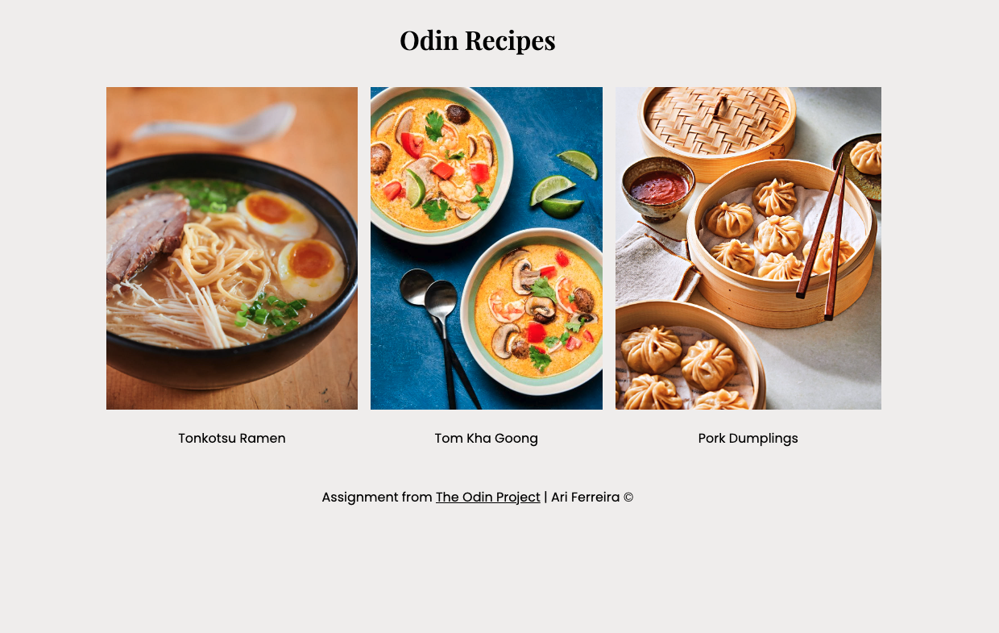

# Odin Recipes

Live Demo: <a href="https://ariferreira/odin-recipes/" target="_blank" noreferrer>Odin Recipes</a>

Screenshot from Odin Recipes - Desktop
 
 
<video height="400" controls autoplay>
 <source src="./images/mobile.mp4" type="video/mp4">
</video>
 
Video from Odin Recipes - Mobile

## Overview

This assignment <a href="https://www.theodinproject.com/lessons/foundations-recipes" target="_blank" noreferrer>Project: Recipes</a> was set as part of the<a href="https://www.theodinproject.com/" target="_blank" noreferrer>> The Odin Project</a> curriculum. This is a very basic website with 3 recipe pages.

## Considerations

Project was fairly basic and easy. Just to practice HTML knowledge acquired from foundations. Great to refresh memory and later practiced and added CSS properties. :smiley:

## Recipes from

- <a href="https://glebekitchen.com/tonkotsu-ramen-home/" target="_blank" noreferrer>Tonkotsu Ramen</a>
- <a href="https://www.rockinmealss.com/blog/2021/1/20/shrimp-tom-kha" target="_blank" noreferrer>Tom Kha Goong</a>
- <a href="https://www.allrecipes.com/recipe/14759/pork-dumplings/" target="_blank" noreferrer>Pork Dumplings</a>
